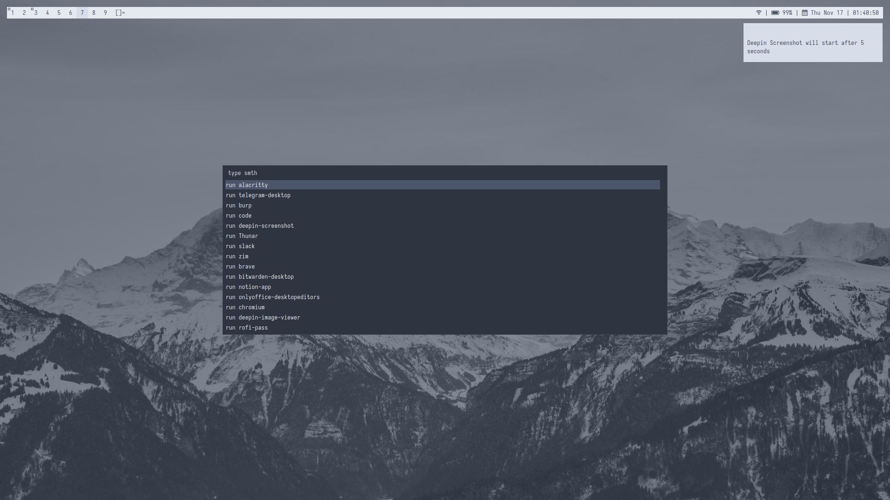

# My current desktop configuration

Current theme: [Nord](https://www.nordtheme.com/)

## :ice_cube: Overview

- Desktop manager: DWM with patches ([`dwm-flexipatch`](https://github.com/bakkeby/dwm-flexipatch)).
- Status bar: [`dwmblocks-async`](https://github.com/UtkarshVerma/dwmblocks-async).
- Terminal: [`alacritty`](https://github.com/alacritty/alacritty)
- Application Launcher: [`rofi`](https://github.com/davatorium/rofi) (`~/.config/rofi/*`)
- PDF reader: [`zathura`](https://github.com/pwmt/zathura) (`~/.config/zathura/zathurarc`)
- Screen lock: [`script`](i3lock_run.sh) using [`i3lock`](https://github.com/i3/i3lock)

## Configuration

### DWM

I use [`dwm-flexipatch`](https://github.com/bakkeby/dwm-flexipatch).

List of enabled patches:

* ...
* ...

### dwmblocks-async

Blocks are clickable. This requires [`extra/libnotify`](https://man.archlinux.org/man/notify-send.1.en) package and a few patches enabled in the `dwm-flexipatch` config.
