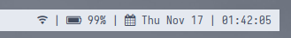

# My current desktop configuration

Current theme: [Nord](https://www.nordtheme.com/)

## :ice_cube: Overview

- Desktop manager: DWM with patches ([`dwm-flexipatch`](https://github.com/bakkeby/dwm-flexipatch)).
- Status bar: [`dwmblocks-async`](https://github.com/UtkarshVerma/dwmblocks-async).
- Terminal: [`alacritty`](https://github.com/alacritty/alacritty)
- Application Launcher: [`rofi`](https://github.com/davatorium/rofi)
- PDF reader: [`zathura`](https://github.com/pwmt/zathura)
- Screen lock: [`script`](i3lock_run.sh) using [`i3lock`](https://github.com/i3/i3lock)

## :rice_ball: Configuration

### DWM

I use [`dwm-flexipatch`](https://github.com/bakkeby/dwm-flexipatch).

List of enabled patches:

* BAR_DWMBLOCKS_PATCH
* BAR_STATUSCMD_PATCH
* BAR_CENTEREDWINDOWNAME_PATCH
* BAR_HEIGHT_PATCH
* BAR_PADDING_PATCH
* BAR_STATUSALLMONS_PATCH
* FLOATPOS_PATCH
* FLOATPOS_RESPECT_GAPS_PATCH
* LG3D_PATCH
* PERTAG_PATCH
* TOGGLELAYOUT_PATCH
* VANITYGAPS_PATCH
* VANITYGAPS_MONOCLE_PATCH

### dwmblocks-async

Blocks are clickable. This requires [`extra/libnotify`](https://man.archlinux.org/man/notify-send.1.en) package and a few patches enabled in the `dwm-flexipatch` config. Also it requires [`dunst`](https://github.com/dunst-project/dunst) notification daemon installed.

The appearance of `notify-send` is sat up in [`dunstrc`](dunst/dunstrc) config file (`~/.config/dunst/dunstrc`).

### alacritty

location: `~/.config/alacritty/`

### rofi

location: `~/.config/rofi/`

### zathura

location: `~/.config/zathura/zathurarc`
